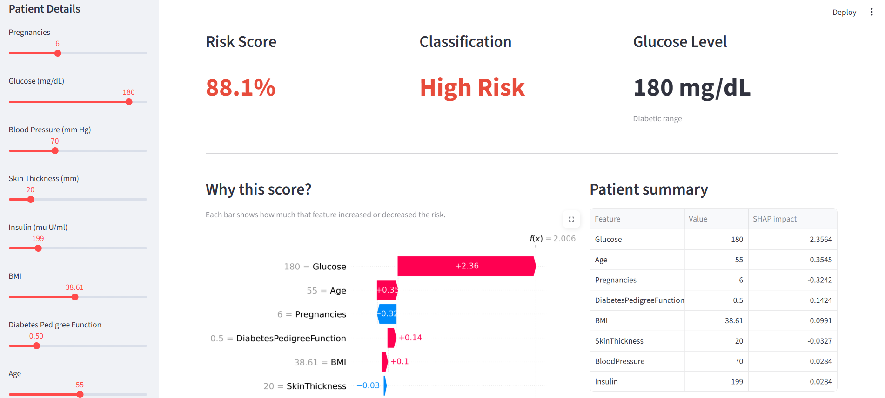

# 🩺 Diabetes Risk Scoring Engine

An end-to-end machine learning pipeline that predicts a patient's diabetes 
risk, explains the prediction using SHAP, and presents results in an 
interactive Streamlit dashboard.

---

## 📊 Live Results

| Metric | Value |
|---|---|
| ROC-AUC Score | 0.823 |
| Model | XGBoost Classifier |
| Dataset | Pima Indians Diabetes (768 patients) |
| Features used | 8 clinical features |

---

## 🔍 Key Findings (SQL Analysis)

- **Glucose** is the strongest predictor of diabetes risk (confirmed by both 
  correlation analysis and SHAP values)
- Patients in the **diabetic glucose range (>125 mg/dL)** have a diabetes 
  rate of 64%
- The highest risk patient segment is **Senior + Obese** with a 64.9% 
  diabetes rate
- **Middle-aged obese** patients are the largest high-risk group 
  (168 patients, 59.5% diabetes rate)

---

## 🛠️ Project Structure
```
diabetes-risk-scorer/
│
├── data/
│   ├── diabetes.csv                  # Raw dataset
│   ├── diabetes_cleaned.csv          # Cleaned + engineered features
│   ├── shap_values.csv               # Pre-computed SHAP values
│   └── sql_risk_segments.csv         # SQL analysis results
│
├── model/
│   ├── xgb_model.pkl                 # Trained XGBoost model
│   └── scaler.pkl                    # Fitted StandardScaler
│
├── charts/
│   ├── shap_summary.png              # SHAP feature importance
│   ├── shap_waterfall.png            # Single patient explanation
│   ├── confusion_matrix.png          # Model evaluation
│   └── dashboard_screenshot.png     # App screenshot
│
├── notebooks/
│   ├── 01_exploration.ipynb          # EDA and visualisations
│   ├── 02_preprocessing.ipynb        # Cleaning and feature engineering
│   ├── 03_model.ipynb                # Model training and evaluation
│   └── 04_shap.ipynb                 # SHAP explainability
│
├── app.py                            # Streamlit dashboard
├── 06_sql_analysis.py                # SQL analytics layer
├── requirements.txt                  # Dependencies
└── README.md
```

---

## ⚙️ How to run it

**1. Clone the repo**
```bash
git clone https://github.com/YOURUSERNAME/diabetes-risk-scorer
cd diabetes-risk-scorer
```

**2. Install dependencies**
```bash
pip install -r requirements.txt
```

**3. Run the dashboard**
```bash
streamlit run app.py
```

---

## 🧰 Tech Stack

| Layer | Tools |
|---|---|
| Data processing | Python, Pandas, NumPy |
| Machine learning | XGBoost, Scikit-learn |
| Explainability | SHAP |
| Analytics | SQL, SQLite |
| Dashboard | Streamlit, Matplotlib |
| Visualisation | Seaborn, Matplotlib |

---

## 📸 Dashboard Preview



---

## ⚠️ Disclaimer

This project is for educational and portfolio purposes only. It is not a 
medical device and must not be used for clinical decisions.
```

---

### Step 2 — Create requirements.txt

Create `requirements.txt` in your main folder:
```
pandas
numpy
scikit-learn
xgboost
shap
streamlit
matplotlib
seaborn
jupyter
